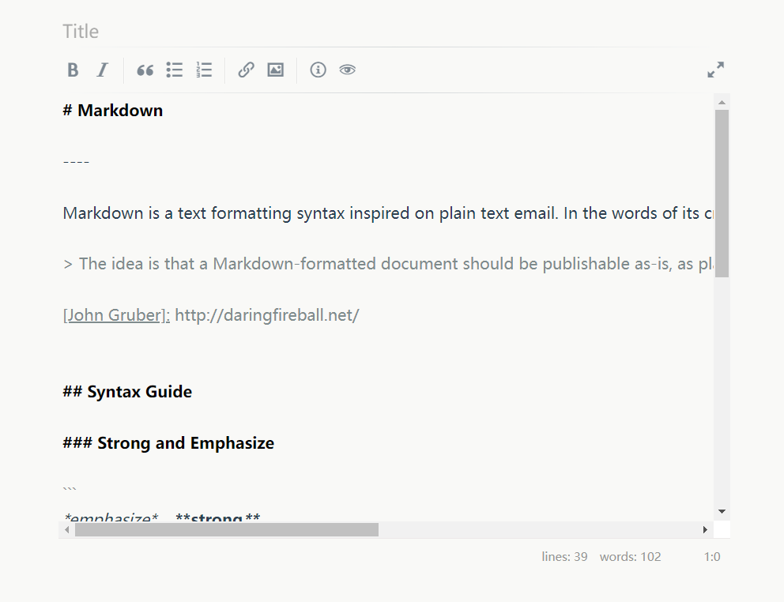

### 非官方简明Markdown编辑器插件Editor v1.0.2

采用lepture的开源项目[editor](http://lab.lepture.com/editor/)，特点是可视化、标记自动完成和快捷键等。

更多详见作者博客：http://imnerd.org/editor-plugin-for-typecho.html

官方在线编辑器：https://lab.lepture.com/editor/

插件截图：

